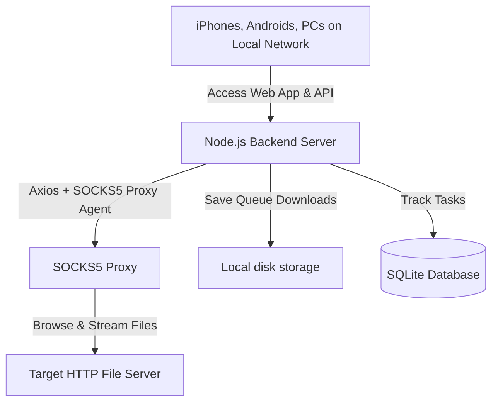

# DirXplore 🚀
### AMOLED Dark HTTP Directory Browser & Download Manager

DirXplore is a high-fidelity, production-ready directory browser and download manager. It consists of a **Flutter Web Frontend (PWA)** styled with a premium AMOLED Dark Theme and a **Node.js + SQLite Backend** that can route requests through a SOCKS5 proxy to browse and download files from private HTTP servers.

---

## 🏗️ Architecture



---

## 📱 How to Host and Use on Multiple Devices (Step-by-Step)

To access the app on other devices (like iPhones, iPads, Android devices, or other computers on your network), you must host the backend and frontend on your host PC and connect to it over your local network (Wi-Fi).

### Step 1: Build the Flutter Web Frontend
First, compile the frontend into optimized static HTML, CSS, and JS files. The Node.js backend will automatically detect and host these files on a single port.
```bash
flutter build web --release
```
*(This builds the files into the `build/web` folder, which the backend is pre-configured to serve).*

### Step 2: Configure the Backend Environment
Create or update the `.env` file in the `backend/` directory to configure your defaults:
```env
PORT=3000
DEFAULT_HTTP_SERVER=http://172.16.50.4/
DEFAULT_PROXY_HOST=103.166.253.92
DEFAULT_PROXY_PORT=1088
DEFAULT_PROXY_USER=test
DEFAULT_PROXY_PASS=test
DATABASE_FILE=downloads.db
DOWNLOAD_DIR=./downloads
MAX_CONCURRENT_DOWNLOADS=3
```

### Step 3: Find Your Host PC's Local IP Address
To connect from other devices, you need your host computer's local IP address.
* **On Windows (PowerShell/CMD):**
  Run `ipconfig` and look for the **IPv4 Address** under your active Wi-Fi or Ethernet adapter (e.g., `192.168.1.5` or `172.16.x.x`).
* **On macOS/Linux:**
  Run `ifconfig` or `ip a` and look for the IP address associated with your active network interface.

### Step 4: Start the Node.js Server
Navigate to the `backend` directory and start the production server:
```bash
cd backend
npm install
node server.js
```
The server will output:
```text
Connected to SQLite database at: F:\dirxploreios\backend\downloads.db
Database table initialized successfully.
Configured static server for Flutter Web build at: F:\dirxploreios\build\web
Server listening on port 3000
```

### Step 5: Connect From Your iPhone / Android / Other Devices
1. Ensure your mobile devices (iPhone, Android) are connected to the **same Wi-Fi network** as your host PC.
2. Open **Safari** (on iOS) or **Chrome** (on Android) and navigate to:
   ```text
   http://<YOUR-PC-IP>:3000
   ```
   *(Replace `<YOUR-PC-IP>` with the IPv4 address you found in Step 3, for example: `http://192.168.1.5:3000`)*.
3. The AMOLED dark UI will load instantly.

### Step 6: Install the App as a PWA (Recommended for iPhones)
Since DirXplore is built as a Progressive Web App (PWA), you can install it directly to your home screen so it runs like a native app without browser navigation bars:
* **On iPhone (Safari):**
  1. Click the **Share** button (the square with an up arrow at the bottom).
  2. Scroll down and tap **Add to Home Screen**.
  3. Launch **DirXplore** from your home screen.
* **On Android (Chrome):**
  1. Tap the three dots menu in the top right.
  2. Tap **Install App** or **Add to Home screen**.

---

## ⚙️ Configuration & App Settings

Once the app is running on your iPhone or other device, navigate to the **Settings** tab (the gear icon ⚙️) to adjust active configs:

1. **Target HTTP Server**: The address of the file index server you want to browse (defaults to `http://172.16.50.4/`).
2. **SOCKS5 Proxy Host & Port**: The proxy details used to tunnel connections.
3. **Proxy Credentials**: Username and password (defaults to `test` / `test`).
4. **Proxy Toggle**: Turn the SOCKS5 proxy on or off depending on whether your target server requires it.
5. **Backend Server URL**: If you're hosting the backend on a different port or device, you can point your web client to it here (defaults to the hosting origin `http://<ip>:3000`).
6. **Server Download Directory**: Where the backend saves downloads when queued.
7. **Max Concurrent Downloads**: Limit the number of parallel downloads running on the server.
8. **Default Download Behavior**:
   * *Ask Every Time*: Prompts you on every click.
   * *Save to Device*: Direct download to phone's storage.
   * *Queue on Server*: Remote download on the server.

---

## 🛠️ Local Development (Separated Ports)

If you are modifying the codebase and want hot-reload enabled:

1. **Run Backend (Port 3000)**:
   ```bash
   cd backend
   npm install
   node server.js
   ```
2. **Run Frontend (Port 5000+ with hot reload)**:
   ```bash
   flutter run -d chrome
   ```
   In the browser, go to the **Settings** tab and ensure the **Backend Server URL** is pointing to `http://localhost:3000`. Changes in `main.dart` will hot reload instantly in your browser!
